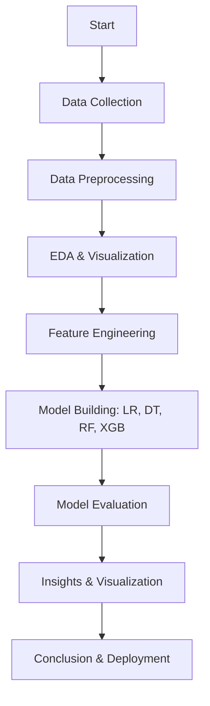

# 🏠 Forecasting House Prices Using Smart Regression Techniques

## 📌 Project Overview

This project aims to **accurately predict house prices** using advanced regression techniques in data science. Leveraging a structured housing dataset, we apply models such as Linear Regression, Decision Trees, Random Forests, and Gradient Boosting to understand and forecast house prices effectively.

---

## 🎯 Objectives

- Forecast house prices based on historical and real estate data.
- Identify key features that influence house pricing.
- Implement and compare various regression models for prediction.
- Provide visual insights and recommendations for real-world application.

---

## 📊 Problem Statement

Accurate house price prediction helps stakeholders — buyers, sellers, banks, and investors — make informed decisions. By analyzing multiple features such as square footage, location, number of rooms, and year built, we can build predictive models that aid in smart real estate planning.

---

## 🛠 Tools & Technologies Used

- **Language:** Python  
- **Environment:** Jupyter Notebook, Google Colab  
- **Libraries:**
  - Data: `pandas`, `numpy`, `scipy`
  - Modeling: `scikit-learn`, `xgboost`, `lightgbm`
  - Visualization: `matplotlib`, `seaborn`, `plotly`

---

## 🔄 Workflow



---

## 🧾 Dataset Description

Features from the dataset include:

- `SalePrice` – Target variable
- `GrLivArea` – Above-ground living area
- `YearBuilt` – Year the house was built
- `OverallQual` – Quality score
- `GarageCars`, `FullBath`, `Neighborhood`, etc.

---

## 🧹 Data Preprocessing

- Removed or imputed missing values.
- Dropped non-informative or high-missing columns.
- Normalized numerical features.
- Encoded categorical features using one-hot and ordinal encoding.

---

## 📈 Exploratory Data Analysis

- Histograms, boxplots, scatter plots
- Correlation matrix
- Outlier detection
- Insights into features with highest impact on price (e.g. `OverallQual`, `GrLivArea`)

---

## ⚖️ Feature Engineering

- Created new features like `TotalBathrooms`, `HouseAge`, `TotalSF`
- Applied log transformation to reduce skewness
- Removed multicollinearity and selected best features via Lasso, RF importance, and SelectKBest

---

## 🤖 Models Implemented

- **Linear Regression**
- **Ridge & Lasso Regression**
- **Decision Tree Regressor**
- **Random Forest Regressor**
- **Gradient Boosting (XGBoost, LightGBM)**

Evaluation Metrics:
- R² Score
- MSE / RMSE
- Cross-validation

---

## 📊 Results Visualization

- Actual vs Predicted plots
- Residual plots
- Feature importance bar charts
- Distribution plots of predicted vs actual prices


## House prediction 

---

## 👨‍💼 Team Members & Contributions

| Name           | Register Number | Contributions |
|----------------|------------------|---------------|
| Tamilselvan    | 412323104060     | EDA, planning, visualization |
| Thennarasu     | 412323104063     | Preprocessing, modeling, evaluation |
| Yuvaraj        | 412323104069     | Documentation, flowcharts, presentation |

---

## 💎 Repository Structure

```
📁 house-price-prediction/
🔝 data.csv
🔝 model_building.ipynb
🔝 README.md
🔝 requirements.txt
📁 visuals/
    🔝 actual_vs_predicted.png
    🔝 feature_importance.png
```

---

## 🔗 GitHub Repository

👉 [GitHub Link](https://github.com/Thennarasu0302/Forecasting-house-prices-accurately-using-smart-regression-techniques-in-data-science)

---


## 📍 Institution Details

- **Student Name:** Thennarasu P
- **Department:** Computer Science & Engineering  
- **College:** Sri Ramanujar Engineering College  

---

## ✅ License

MIT License. You’re free to use, modify, and distribute this project for educational and research purposes
